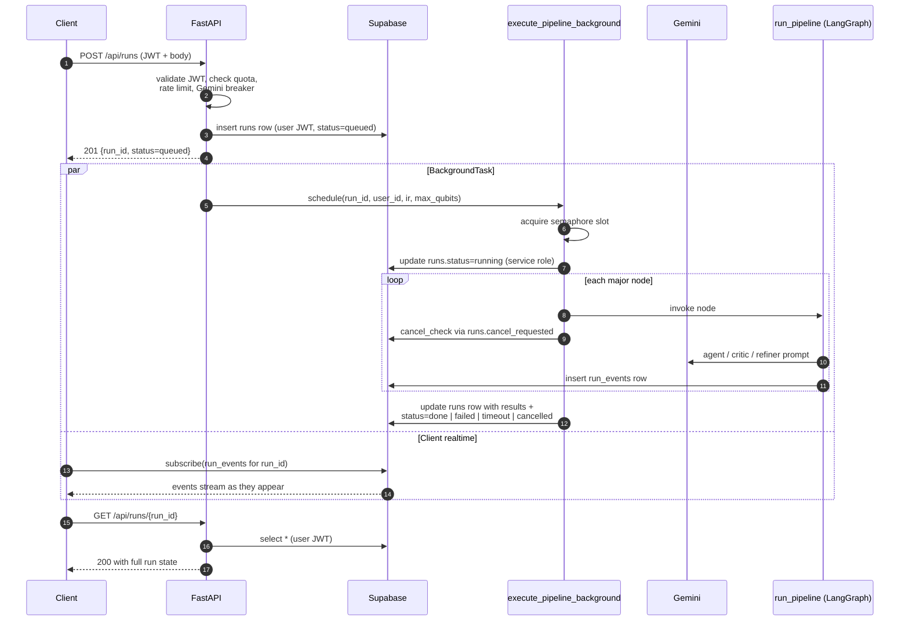

# Architecture

QSim Playground is a typed full-stack application with a pure Python core,
a FastAPI service boundary, and a Next.js frontend that hangs off it.
Authentication and storage live in Supabase; the QUBO pipeline runs
inline inside the FastAPI worker via FastAPI BackgroundTasks.

## Components

- `backend/core`: pure domain logic with no network or database I/O —
  IR, parser, templates, agents, evaluator, orchestrator, circuit
  generation, classical baseline, qubit-cap primitives.
- `backend/api`: FastAPI routes, dependencies, middleware, the background
  executor, and the server-side limits module (`api/limits.py`).
- `backend/infra`: external clients and operational integrations —
  Supabase factories (`anon`, `service`, `user`-bearer), the hardened
  Gemini client + circuit breaker, and pydantic settings.
- `backend/cli`: local Typer commands for foundation and pipeline
  validation that bypass the API.
- `frontend`: Next.js App Router application (Day 4).

## Execution model

`POST /api/runs` returns in under a second by deferring the actual
pipeline work to a FastAPI BackgroundTask:

1. The handler validates the JWT, enforces tier quota and the rolling
   per-user rate limit, fast-fails if the Gemini circuit breaker is
   open, parses the IR, inserts a `queued` row into `runs` via the
   user's JWT (so RLS applies), and schedules
   `execute_pipeline_background` with the run id, user id, IR, and
   tier-derived `max_qubits` cap.
2. `execute_pipeline_background` (in `backend/api/execution.py`)
   acquires a slot from a module-level
   `asyncio.Semaphore(MAX_CONCURRENT_PIPELINES=10)`, switches the run
   to `running`, and invokes `run_pipeline` wrapped in
   `asyncio.wait_for(timeout=180.0)`.
3. Each LangGraph node fires an event into `run_events` through a
   service-role Supabase client (RLS doesn't apply to that role) so the
   frontend can subscribe in realtime. Between major nodes the
   orchestrator polls `runs.cancel_requested`; if it flips to `true`
   the pipeline raises `PipelineCancelled` and the run is finalised
   with `status='cancelled'`.
4. On completion, the executor writes the full result back to `runs`
   (qubos, scorecards, critic verdict, refined QUBO, circuit data,
   simulation + classical results, `total_runtime_ms`, `completed_at`)
   and emits a final `pipeline_done` / `pipeline_failed` /
   `pipeline_cancelled` event.

Cloud Run keeps the container alive while any request handler is still
running, and that includes its registered BackgroundTasks (see
[ADR-002](DECISIONS.md#adr-002-background-execution-without-an-external-queue)
for the full trade-off analysis and scaling envelope).

## Multi-user isolation

Isolation is enforced at three layers, so a bug in one is caught by the
next:

1. **Database — Row-Level Security.** Every table in
   `backend/infra/migrations/001_initial_schema.sql` has RLS enabled
   and an explicit `using (auth.uid() = …)` policy. The
   `runs_select_own_active` / `runs_update_own` / `runs_insert_own`
   policies make it physically impossible for one user's JWT to read or
   mutate another user's rows. `run_events` join through `runs` so
   event leakage is also blocked at the DB. Service-role keys bypass
   RLS and are only used by trusted server code
   (`backend/api/execution.py` and the rate-limit and quota paths) —
   `infra/supabase.py` guards accidental service-role use from a
   request handler.
2. **API — JWT + per-user clients.** `api/deps.py:get_current_user`
   validates the Supabase JWT with the project's JWT secret, stashes
   the bearer JWT on `request.state`, and every route fetches a
   `get_user_client(bearer_jwt)` for its Supabase calls. Cross-user
   `GET /api/runs/{run_id}` deliberately returns **404** rather than
   403 so we never leak the existence of another user's run.
3. **Application — per-tier limits.** `api/limits.py` enforces
   `monthly_runs`, `runs_per_minute`, and `max_qubits` for `free` /
   `pro` / `enterprise` tiers, with all counters maintained server-side
   in `users_profile.monthly_runs_used` (incremented by the
   `runs_increment_monthly_runs_used` trigger) and `rate_limit_log`.
   The qubit cap is threaded into the orchestrator and tripped inside
   `evaluator.evaluate_qubo` and `circuit_gen.build_qaoa_circuit`, so a
   tier violation surfaces as a `pipeline_failed` event with a clear
   message instead of an opaque downstream error.

The `backend/tests/test_concurrent_users.py` smoke test exercises all
three layers together against a real Supabase project; the
`backend/scripts/manual_concurrency_test.py` script is the production
equivalent used during deploy verification (see
[docs/OPERATIONS.md → Concurrency Verification](OPERATIONS.md#concurrency-verification)).

## Request lifecycle



## Frontend data flow

The Next.js client renders the run-detail page in two phases: a
server-rendered shell that pre-populates the page with whatever state
the backend already has, and a long-lived client subscription that
streams new events as they arrive.

### Initial render (server)

`app/(app)/runs/[id]/page.tsx` is an async server component. It calls
`lib/api-server.fetchRunInitial(runId)`, which reads the Supabase session
cookie via `@supabase/ssr`, extracts the user's JWT, and issues two
authenticated GETs against the backend in sequence:

1. `GET /api/runs/{id}` — full run row.
2. `GET /api/runs/{id}/events` — every event already written.

Both responses are validated through the shared zod schemas in
`frontend/lib/types.ts`. The page hands the validated `Run` plus the
`PipelineEvent[]` directly to the client `RunDetailView` as props, so
the first paint already shows everything the backend knows.

### Live updates (client)

`components/runs/use-run-stream.ts` is the streaming brain. On mount
it:

1. Seeds React state from the SSR props.
2. Calls `createBrowserClient` and opens a Supabase Realtime channel
   `run-events:{run_id}` with a Postgres-changes filter limited to
   `run_events INSERT` rows where `run_id=eq.<id>`. Supabase's RLS
   policy on `run_events` ensures only events for the caller's run are
   delivered.
3. As each row arrives, it parses via `pipelineEventSchema`, dedupes by
   event id, and appends to React state — components that read the
   state re-render via `deriveLiveState` (a pure reducer over the
   event log).
4. On a terminal event (`pipeline_done` / `pipeline_failed` /
   `pipeline_cancelled`) it unsubscribes and re-fetches the full run
   with `GET /api/runs/{id}` so the persisted result fields populate
   the panels.

### Polling fallback

If the Supabase channel reports `CLOSED`, `CHANNEL_ERROR`, or
`TIMED_OUT`, the hook flips to a 3-second polling loop hitting
`GET /api/runs/{id}/events?after_event_id=<highest seen id>`. The
loop:

- Catches up missed events (the connection might have dropped during
  a burst).
- Surfaces no UI noise — a `Polling` badge in the page header is the
  only signal.
- Tears down again as soon as the channel resubscribes.

This is the "kill WiFi mid-run" recovery path. The badge in the
`RunDetailView` header transitions
`Connecting…` → `Live` → `Polling` → `Live` automatically; the user
never has to click anything.

### Network errors

`lib/api.ts:apiFetch` wraps every backend call. A thrown `fetch`
(offline, DNS failure, backend down) is caught and surfaced as a
`Network error — check your connection` toast plus an `ApiError`
with `status=0`. Non-2xx responses route through
`lib/error-state.describeApiError`, which classifies the status code
(`auth` / `rate_limit` / `service_busy` / `validation` /
`not_found` / `server` / `network`) and returns title + description
copy; 429 / 503 toasts include a real countdown derived from the
`Retry-After` header (integer seconds or HTTP-date supported).

### Public share path

`app/(public)/share/[id]/page.tsx` mirrors the same SSR pattern but
fetches `GET /api/share/{id}` **without** the authorization header.
The backend route uses the service-role client to bypass RLS, then
filters strictly on `shared = true AND status = 'done' AND
deleted_at IS NULL` and returns a sanitised payload (`SharedRunResponse`,
never includes `user_id` or `error`). The client renders a
`SharedRunView` that re-uses the same agent / scorecard / critic /
refiner / circuit / benchmark components — no streaming hook, no
export controls.

### Code splitting

Two heavy dependencies are lazy-loaded via `next/dynamic` so they
never enter the initial bundle of any page that doesn't need them:

- **Monaco** (`@monaco-editor/react`) loads only when the **Code**
  tab on `/new` is active.
- **Recharts** (`BarChart` + axes + tooltip) loads only when the
  `BenchmarkPanel` on `/runs/[id]` renders.

Both ship `ssr: false` and a `<Skeleton>` placeholder so the layout
doesn't shift while the chunk fetches.

### Keyboard shortcuts

`components/shared/keyboard-shortcuts-provider.tsx` is mounted once
inside the `(app)` layout. It binds a single `window.keydown`
listener and dispatches via `lib/keyboard-shortcuts.matchShortcut`,
which deliberately ignores inputs, textareas, contenteditable
elements, Monaco's `role=textbox` container, and any keydown that
already has `defaultPrevented`. Two shortcuts ship: `n` opens
`/new`, `?` toggles the help dialog.

Plain-ASCII version (for terminals without mermaid):

```
 Client ──POST /api/runs──> FastAPI (auth, RLS via JWT, quota, rate
                            limit, Gemini breaker)
                              │
                              ├──> Supabase.runs INSERT (queued)
                              │
                              ├──> 201 {run_id}        (returned immediately)
                              │
                              └──> BackgroundTask: execute_pipeline_background
                                       │   ┌──── asyncio.Semaphore(10) ────┐
                                       │   │ run_pipeline / LangGraph      │
                                       │   │  ├─ agent x 5 ──> Gemini       │
                                       │   │  ├─ evaluator (qubit cap)      │
                                       │   │  ├─ critic ──> Gemini          │
                                       │   │  ├─ refiner ──> Gemini         │
                                       │   │  ├─ circuit_gen (qubit cap)    │
                                       │   │  └─ runner (Qiskit + classical)│
                                       │   │ cancel_check between each node │
                                       │   └────────────────────────────────┘
                                       │
                                       ├──> Supabase.run_events INSERT (each event)
                                       │       │
                                       │       └──> Supabase Realtime push to subscribed clients
                                       │
                                       └──> Supabase.runs UPDATE (status, results, completed_at)
```
